# Crypto Dashboard + ChainCipher

> Aplikasi web (Python + Streamlit) untuk **memantau harga kripto** dan **mengamankan data off-chain** dengan
> enkripsi berantai bertema blockchain, lengkap dengan **verifikasi integritas berbasis pohon Merkle**.

**Status:** proyek edukasi (tugas kuliah). Algoritma ChainCipher **belum diaudit**, jangan dipakai untuk
melindungi private key, seed phrase, atau aset nyata. Lihat [Keamanan dan Batasan](#13-keamanan-dan-batasan).

---

## Daftar Isi

1. [Ringkasan](#1-ringkasan)
2. [Masalah yang Diselesaikan](#2-masalah-yang-diselesaikan)
3. [Fitur](#3-fitur)
4. [Manfaat bagi Pengguna](#4-manfaat-bagi-pengguna)
5. [Kapan Sistem Ini Dipakai](#5-kapan-sistem-ini-dipakai)
6. [Arsitektur Sistem](#6-arsitektur-sistem)
7. [Alur Penggunaan](#7-alur-penggunaan)
8. [Cara Kerja Algoritma ChainCipher](#8-cara-kerja-algoritma-chaincipher)
9. [Contoh Lengkap: Metadata NFT Rahasia](#9-contoh-lengkap-metadata-nft-rahasia)
10. [Instalasi dan Menjalankan](#10-instalasi-dan-menjalankan)
11. [Struktur Proyek](#11-struktur-proyek)
12. [Pengujian](#12-pengujian)
13. [Keamanan dan Batasan](#13-keamanan-dan-batasan)
14. [FAQ dan Pemecahan Masalah](#14-faq-dan-pemecahan-masalah)
15. [Pengembangan Lanjutan](#15-pengembangan-lanjutan)
16. [Glosarium](#16-glosarium)
17. [Kesesuaian dengan Ketentuan Tugas](#17-kesesuaian-dengan-ketentuan-tugas)
18. [Tim dan Lisensi](#18-tim-dan-lisensi)

---

## 1. Ringkasan

Aplikasi ini terdiri dari tiga bagian yang bekerja bersama:

| Bagian | Fungsi singkat |
|---|---|
| **Akun (Login dan Daftar)** | Hanya pengguna terdaftar yang bisa membuka dashboard dan halaman enkripsi. Password disimpan dalam bentuk hash. |
| **Dashboard Harga Kripto** | Menampilkan harga dan perubahan 24 jam dari Binance secara real-time, lengkap dengan alarm lonjakan harga. |
| **ChainCipher** | Mengenkripsi teks atau file, mendekripsinya kembali, dan membuktikan bahwa isinya tidak diubah, tanpa perlu membuka rahasianya. |

**Analogi mudah untuk ChainCipher.** Bayangkan buku besar (ledger) yang setiap halamannya digembok. Kunci gembok
halaman ke-*n* dibuat dari isi halaman sebelumnya, sehingga bila satu halaman diubah, semua halaman sesudahnya
ikut tidak cocok. Di akhir buku ada **daftar isi ringkas** (disebut *Merkle root*) yang boleh diumumkan ke publik,
misalnya dicatat di blockchain. Siapa pun bisa mencocokkan buku dengan daftar isi itu untuk memastikan buku
tidak diubah, tetapi hanya pemegang **passphrase** yang bisa membaca isinya.

---

## 2. Masalah yang Diselesaikan

1. **Blockchain bersifat publik dan permanen.** Data sensitif tidak boleh ditulis mentah ke sana, karena tidak bisa
   dihapus dan bisa dibaca siapa saja.
2. **Data besar biasanya disimpan off-chain** (IPFS, cloud, server sendiri). Pertanyaannya: bagaimana orang lain
   yakin file itu tidak diganti diam-diam?
3. **Belajar kriptografi sering terasa seperti "kotak hitam".** Di sini setiap langkah bisa dilihat, diuji, dan diukur.

**Pola solusinya:** *enkripsi data lalu simpan off-chain, sedangkan sidik jarinya (Merkle root) dicatat on-chain.*
Rahasia tetap tertutup, tetapi keutuhan data bisa dibuktikan oleh siapa pun.

---

## 3. Fitur

| Kelompok | Fitur | Keterangan |
|---|---|---|
| Akun | Daftar akun | Nama, email, username, password dengan aturan kekuatan |
| Akun | Login dan logout | Sesi tersimpan lewat cookie bertanda tangan (30 hari) |
| Dashboard | Harga 9 koin | Data resmi Binance 24 jam, koin dapat diganti lewat sidebar |
| Dashboard | Auto-refresh | Interval 5 sampai 60 detik |
| Dashboard | Alarm lonjakan | Pemberitahuan teks dan suara bila perubahan melewati ambang (0,5 sampai 10 persen) |
| Dashboard | Unduh CSV | Seluruh tabel pasar dapat diunduh |
| ChainCipher | Enkripsi teks dan file | Hingga 256 KiB; hasil berupa Base64 dan file `.ccv1` |
| ChainCipher | Merkle root | Sidik jari ciphertext yang siap di-anchor ke blockchain |
| ChainCipher | Dekripsi | Tag keaslian diperiksa **sebelum** data dibuka |
| ChainCipher | Verifikasi Merkle | Cek keutuhan tanpa passphrase, plus bukti per blok (Merkle proof) |
| ChainCipher | Analisis | Uji avalanche, rantai hash per blok, dan jejak enkripsi blok pertama |
| Kualitas | Unit test | 65 test: roundtrip, deteksi perubahan, vektor uji tetap, Merkle, avalanche |

---

## 4. Manfaat bagi Pengguna

### 4.1 Manfaat per jenis pengguna

| Pengguna | Yang didapat |
|---|---|
| **Mahasiswa kriptografi / keamanan** | Memahami cara kombinasi substitusi, transposisi, difusi, dan hash chain bekerja. Ada jejak per ronde dan uji avalanche untuk bahan laporan. |
| **Dosen / penilai** | Rancangan terdokumentasi, bisa direproduksi, dan punya vektor uji tetap sehingga hasilnya bisa diperiksa ulang. |
| **Developer Web3** | Contoh nyata pola *encrypt off-chain, anchor on-chain*, termasuk pohon Merkle dan bukti per blok. |
| **Kreator / pemilik NFT** (konsep) | Konten rahasia (kode redeem, tautan privat) dapat dilindungi, dan keutuhannya bisa dibuktikan kepada pembeli. |
| **Auditor / pihak ketiga** | Memeriksa bahwa dokumen tidak berubah **tanpa** perlu mengetahui isinya atau passphrase. |
| **Pengamat pasar kripto** | Memantau harga real-time dan mendapat alarm saat harga melonjak, tanpa membuka banyak situs. |
| **Pengelola aplikasi** | Akun pengguna terlindungi: password tidak disimpan mentah, dan akses halaman dibatasi login. |

### 4.2 Manfaat dari sisi jaminan keamanan

| Jaminan | Artinya bagi pengguna | Dicapai dengan |
|---|---|---|
| **Kerahasiaan** | Tanpa passphrase, isi data tidak bisa dibaca | Cipher blok 6 ronde + kunci dari scrypt |
| **Keutuhan** | Perubahan sekecil apa pun ketahuan | Hash chain, pohon Merkle, HMAC |
| **Keaslian** | Hanya pemegang passphrase yang bisa membuat paket yang lolos pemeriksaan | HMAC-SHA256 (encrypt-then-MAC) |
| **Bukti publik** | Pihak lain dapat memverifikasi tanpa rahasia | Merkle root dan Merkle proof |
| **Ketertelusuran** | Terlihat blok mana yang berubah dan bagaimana efeknya merambat | Tabel rantai blok di halaman |
| **Kemudahan belajar** | Setiap langkah bisa dilihat, diuji, dan dijelaskan | Jejak ronde, uji avalanche, test otomatis |

---

## 5. Kapan Sistem Ini Dipakai

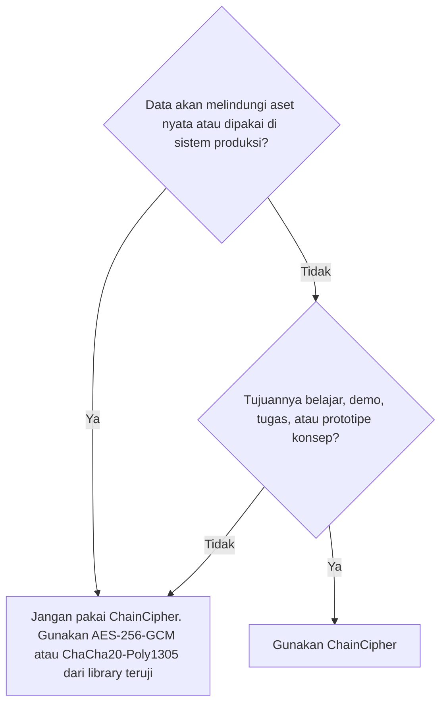

**Cocok dipakai untuk:**
- Tugas kuliah, praktikum, dan presentasi kriptografi atau Web3.
- Demo pola *encrypt off-chain, anchor on-chain*.
- Prototipe alur verifikasi integritas dokumen atau metadata NFT dengan data dummy.
- Belajar membaca jejak enkripsi dan mengukur avalanche.

**Jangan dipakai untuk:** private key, seed phrase, data pribadi nyata, atau sistem produksi.

---

## 6. Arsitektur Sistem

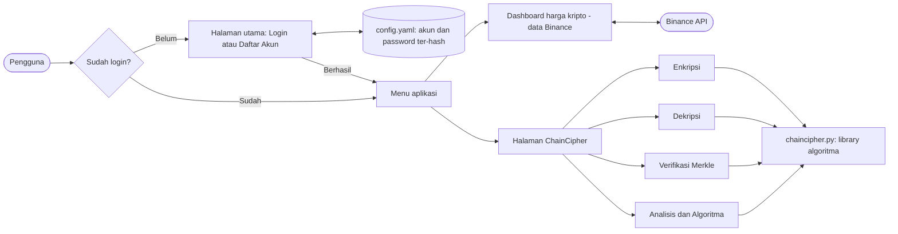

Prinsip rancangan:
- **Library terpisah dari tampilan.** `chaincipher.py` tidak bergantung pada Streamlit, sehingga bisa diuji sendiri.
- **Gerbang akses.** Halaman ChainCipher menolak pengguna yang belum login.
- **Tidak ada rahasia yang disimpan.** Passphrase dan kunci hanya ada di memori selama proses berjalan.

---

## 7. Alur Penggunaan

### 7.1 Daftar akun dan login

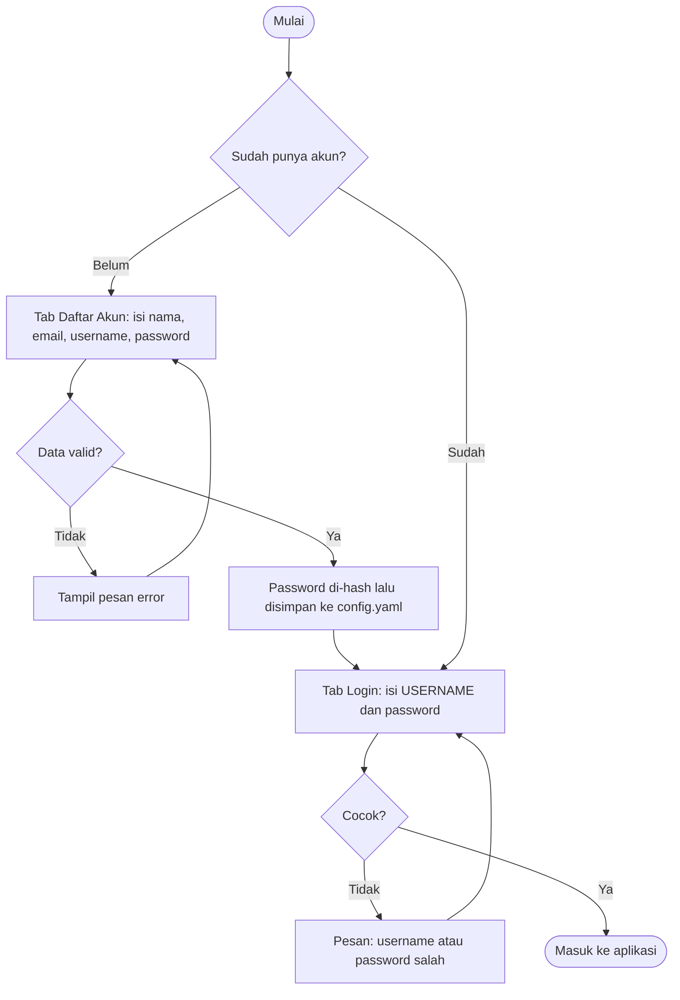

**Aturan pendaftaran:**
- **Username:** huruf, angka, tanpa spasi. Username inilah yang dipakai untuk login (bukan nama lengkap atau email).
- **Password:** 8 sampai 20 karakter, mengandung huruf besar, huruf kecil, angka, dan satu simbol dari `@ $ ! % * ? &`.
- Nama depan dan belakang minimal 2 karakter; email harus belum terdaftar.

### 7.2 Enkripsi

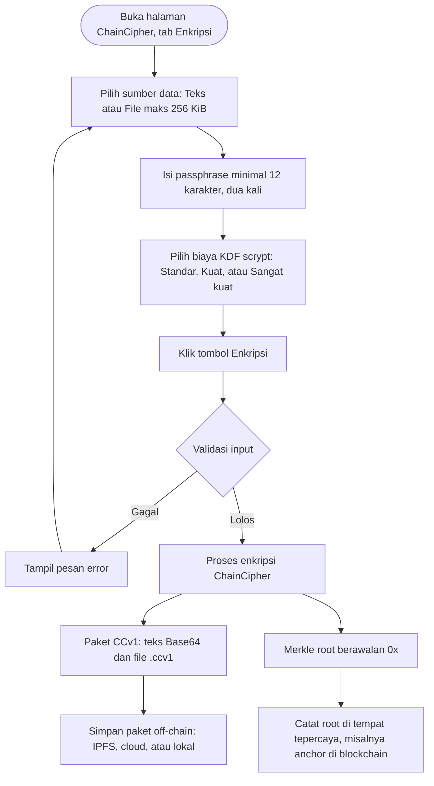

Hasil enkripsi **berbeda setiap kali** walau pesan dan passphrase sama, karena setiap proses memakai salt acak baru.
Paket apa pun tetap bisa dibuka dengan passphrase yang sama.

### 7.3 Dekripsi

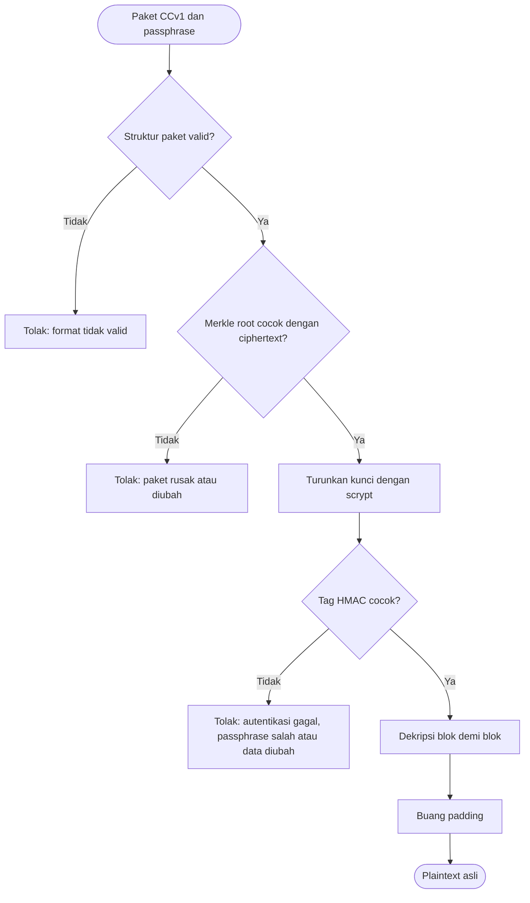

Urutan ini disengaja: **tag diperiksa sebelum dekripsi dijalankan**, dan pesan error untuk "passphrase salah" dan
"data diubah" dibuat sama agar tidak membocorkan informasi kepada penyerang.

### 7.4 Verifikasi Merkle (tanpa passphrase)

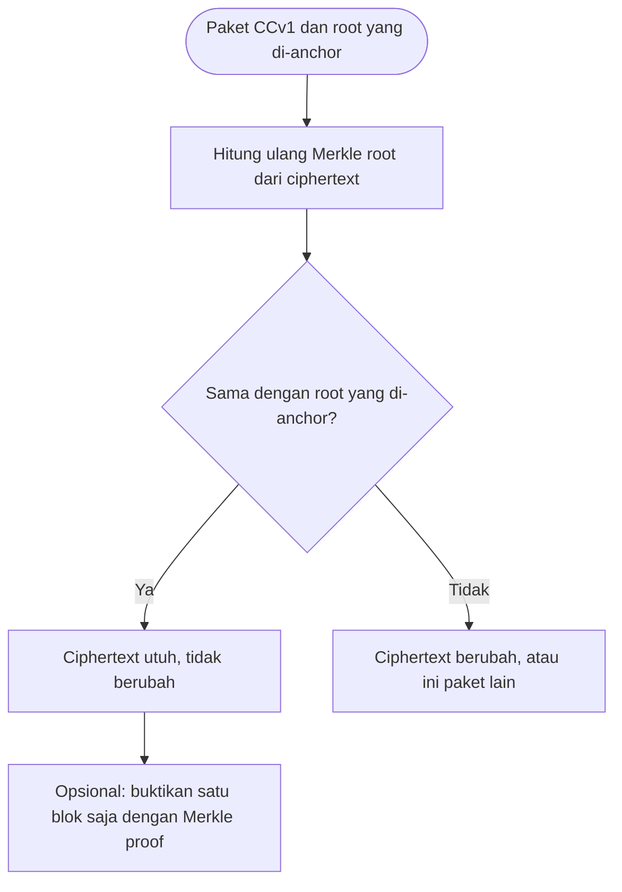

> **Penting:** kecocokan dengan root yang *tertulis di dalam paket* hanya membuktikan konsistensi internal, karena
> siapa pun bisa menghitung ulang root. Keaslian sebenarnya baru terbukti bila dibandingkan dengan root yang
> **dicatat di sumber tepercaya** (misalnya blockchain). Karena itu aplikasi meminta root anchor sebagai pembanding.

### 7.5 Skenario Web3 dari awal sampai akhir

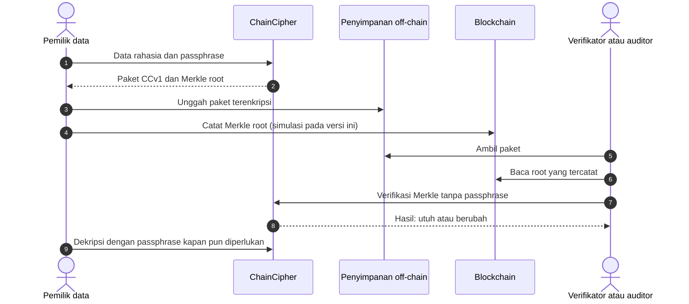

> Pada versi ini pencatatan root ke blockchain **belum terhubung sungguhan**; aplikasi menyiapkan nilai root dan
> memverifikasinya. Integrasi smart contract ada di [Pengembangan Lanjutan](#15-pengembangan-lanjutan).

---

## 8. Cara Kerja Algoritma ChainCipher

### 8.1 Gambaran besar

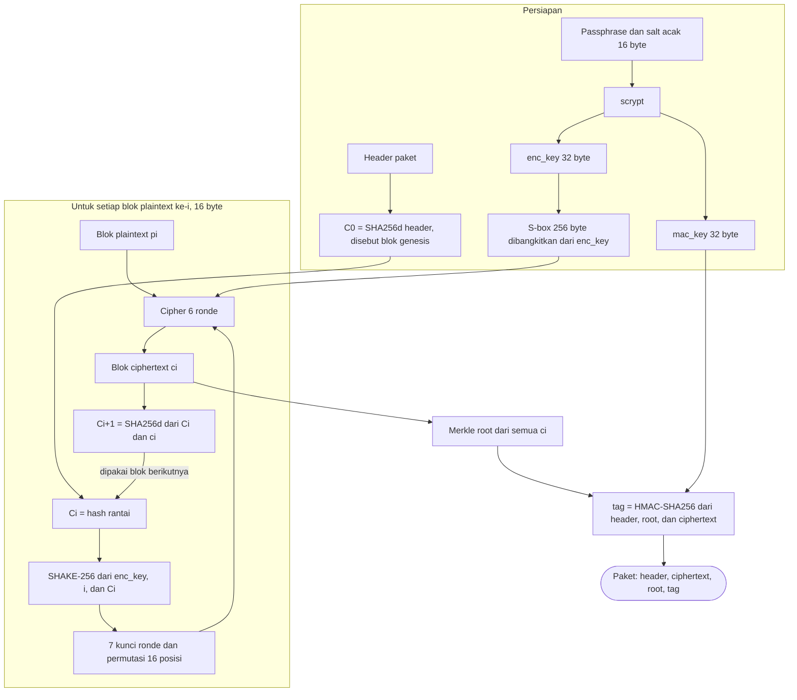

### 8.2 Tahapan dalam bahasa sederhana

| No | Tahap | Penjelasan awam | Mengapa penting |
|---|---|---|---|
| 1 | **Turunkan kunci** (scrypt) | Passphrase "diaduk" lama dan boros memori dengan garam acak menjadi dua kunci | Menebak passphrase jadi mahal; garam membuat kunci unik per pesan |
| 2 | **Padding dan pecah blok** | Pesan diberi tambalan agar kelipatan 16 byte, lalu dipotong per 16 byte | Cipher bekerja pada blok berukuran tetap |
| 3 | **Genesis** | Hash header menjadi "blok pertama" rantai | Mengikat rantai pada parameter paket |
| 4 | **Kunci per blok** | Tiap blok punya kunci dan pola pengacakan sendiri, dari kunci utama + nomor blok + hash rantai | Blok yang isinya sama tetap terenkripsi berbeda |
| 5 | **Cipher 6 ronde** | Setiap blok diacak 6 kali (lihat 8.3) | Menyembunyikan pola isi pesan |
| 6 | **Rantai hash** | Hash blok berikutnya dihitung dari hash sebelumnya + ciphertext blok ini | Mengubah satu blok merusak semua blok sesudahnya |
| 7 | **Pohon Merkle** | Semua blok ciphertext diringkas menjadi satu root (lihat 8.5) | Sidik jari publik, bisa dibuktikan per blok |
| 8 | **Tag HMAC** | Segel kriptografis atas header, root, dan ciphertext | Hanya pemegang passphrase yang bisa membuat segel yang sah |

### 8.3 Satu ronde cipher

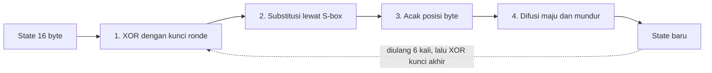

| Langkah | Jenis | Fungsi |
|---|---|---|
| XOR kunci ronde | Pencampuran kunci | Memasukkan kunci ke dalam data |
| Substitusi S-box | **Substitusi** (nonlinear) | Mengganti tiap byte lewat tabel acak 256 entri; **tabel ini unik per pesan**, bukan tabel tetap |
| Acak posisi byte | **Transposisi** | Menukar letak 16 byte; **pola berbeda untuk setiap blok** |
| Difusi | Penyebaran | Rotasi dan XOR berantai maju-mundur sehingga **1 byte yang berubah memengaruhi seluruh blok** |

Semua langkah dapat dibalik secara tepat, itulah yang membuat dekripsi mungkin.

### 8.4 Rantai hash antar blok (ide blockchain)

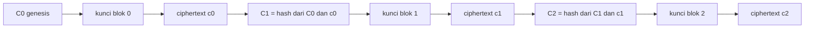

Karena kunci blok ke-*i* bergantung pada hash sebelumnya, **mengubah satu blok akan mengubah kunci semua blok
sesudahnya**. Efek ini bisa dilihat di tab **Analisis**: blok sebelum titik perubahan tetap 0 persen berbeda,
blok sesudahnya berbeda sekitar 50 persen.

### 8.5 Pohon Merkle

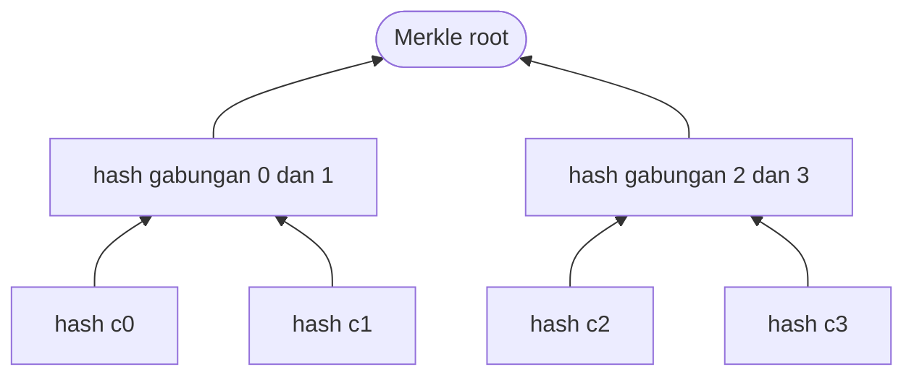

- **Daun** adalah hash tiap blok ciphertext; **root** adalah ringkasan seluruh paket.
- **Merkle proof** membuktikan satu blok milik root hanya dengan beberapa hash saudara (sekitar log2 jumlah blok),
  tanpa perlu seluruh data. Inilah prinsip yang dipakai pada *light client* blockchain.
- Daun dan node memakai pemisah domain, dan node ganjil **tidak diduplikasi** (menghindari kerentanan
  CVE-2012-2459 pada Merkle tree Bitcoin).

### 8.6 Format paket CCv1

| Bagian | Ukuran | Isi |
|---|---|---|
| Header | 29 byte | `CCv1` (4) + parameter scrypt n (1) + salt (16) + panjang ciphertext (8) |
| Ciphertext | kelipatan 16 byte | Blok-blok terenkripsi |
| Merkle root | 32 byte | Sidik jari ciphertext |
| Tag | 32 byte | HMAC-SHA256 atas header, root, dan ciphertext |

Ukuran paket = 29 + panjang ciphertext + 64 byte. Contoh: pesan 571 byte menjadi paket 669 byte.

### 8.7 Parameter

| Parameter | Nilai |
|---|---|
| Ukuran blok | 16 byte |
| Jumlah ronde | 6 (+ XOR kunci akhir) |
| KDF | scrypt, r=8, p=1, n = 2^14 / 2^15 / 2^16 (memori 16 / 32 / 64 MiB) |
| Salt | 16 byte acak per pesan |
| Fungsi hash rantai dan Merkle | SHA-256 ganda (SHA256d), seperti Bitcoin |
| Penurunan kunci blok dan S-box | SHAKE-256 (keluarga SHA-3) |
| Autentikasi | HMAC-SHA256, encrypt-then-MAC |
| Padding | PKCS#7 |
| Batas input (UI) | 256 KiB; passphrase minimal 12 karakter |

### 8.8 Bagian kombinasi dan modifikasi

| Komponen | Asal | Modifikasi pada ChainCipher |
|---|---|---|
| Substitusi | S-box seperti pada cipher blok | **Dibangkitkan dari kunci**, unik per pesan |
| Transposisi | Pengacakan posisi seperti pada cipher klasik | **Unik per blok**, diturunkan dari hash rantai |
| Difusi | Konsep difusi Shannon | Rotasi + XOR berantai **maju dan mundur** |
| Rantai | Hash chain blockchain | Kunci blok bergantung pada **ciphertext blok sebelumnya** |
| Integritas | Pohon Merkle | Root + bukti per blok, **terintegrasi** dengan paket |
| Autentikasi | HMAC | Menyegel header, root, dan ciphertext sekaligus |

### 8.9 Uji avalanche

Membalik **1 bit** plaintext seharusnya mengubah **sekitar 50 persen** bit ciphertext. Tab **Analisis** memeriksa ini
secara interaktif. Pada pesan uji bawaan hasilnya sekitar 53 persen pada blok yang diubah dan sekitar 51 persen secara
keseluruhan, mendekati ideal.

---

## 9. Contoh Lengkap: Metadata NFT Rahasia

Data dummy berikut meniru metadata NFT (format ERC-721) dengan bagian rahasia pemilik (`unlockable_content`):

```json
{
  "name": "Izaki Genesis #42",
  "description": "DATA DUMMY untuk demo ChainCipher. Bukan data asli.",
  "image": "ipfs://bafy-dummy-cid-izaki-genesis-42/image.png",
  "external_url": "https://example.com/nft/42",
  "attributes": [
    { "trait_type": "Rarity", "value": "Legendary" },
    { "trait_type": "Series", "value": "Genesis" },
    { "trait_type": "Edition", "value": 42 }
  ],
  "unlockable_content": {
    "redeem_code": "DUMMY-ABCD-1234-EFGH",
    "private_url": "https://example.com/private/nft-42",
    "note": "Konten rahasia pemilik NFT (dummy)"
  }
}
```

### Langkah demo

1. Login, lalu buka halaman **Enkripsi ChainCipher** di sidebar.
2. Tab **Enkripsi**: pilih **Teks** (tempel JSON di atas) atau **File** (unggah `nft_metadata_rahasia.json`).
3. Isi passphrase dua kali (misalnya `passphrase-aman-123`, hanya untuk demo), lalu klik **Enkripsi**.
4. Salin **Merkle root** (`0x...`) dan **teks Base64**, atau unduh file `.ccv1`.
5. Tab **Dekripsi**: masukkan passphrase yang sama, JSON kembali utuh. Coba passphrase salah untuk melihat penolakan.

### Demo deteksi perubahan

1. Salin teks Base64 ke Notepad, lalu **ganti satu karakter di bagian tengah** (bukan 40 karakter pertama dan bukan
   sekitar 90 karakter terakhir). Jangan menambah atau menghapus karakter.
2. Tab **Verifikasi Merkle**: pilih **Tempel Base64**, tempel teks yang diubah, dan isi kolom **root yang di-anchor**
   dengan root asli.

| Skenario | Hasil yang tampil |
|---|---|
| Paket asli + root asli | Konsistensi **Sesuai**; semua pesan hijau |
| 1 karakter ciphertext diubah | Konsistensi **TIDAK sesuai**; "root BERBEDA"; bukti blok gagal |
| Header diubah | Ditolak sebagai format tidak valid (sebelum Merkle dibandingkan) |
| Hanya tag diubah | Verifikasi Merkle tetap "Sesuai" (tag butuh passphrase); **Dekripsi** menolak dengan "Autentikasi gagal" |

> Jangan mengedit file `.ccv1` langsung di Notepad: itu file biner, dan Notepad merusaknya saat menyimpan.
> Gunakan teks Base64, editor hex, atau skrip Python.

---

## 10. Instalasi dan Menjalankan

**Prasyarat:** Python 3.10 atau lebih baru dan koneksi internet (untuk data Binance).

```bash
# 1. (opsional) buat virtual environment
python -m venv .venv
source .venv/bin/activate        # Windows: .venv\Scripts\activate

# 2. pasang dependensi
pip install -r requirements.txt

# 3. jalankan aplikasi
streamlit run app.py
```

Buka `http://localhost:8501`, daftar akun, login, lalu pilih halaman di sidebar.

> `config.yaml` (data akun) dibuat otomatis saat pertama kali jalan. Jangan di-commit ke repositori; file ini sudah
> ada di `.gitignore`.

---

## 11. Struktur Proyek

```text
.
├── app.py                              # login/daftar akun + dashboard harga kripto
├── chaincipher.py                      # library algoritma (tanpa dependensi Streamlit)
├── pages/
│   └── 1_Enkripsi_ChainCipher.py       # UI: enkripsi, dekripsi, verifikasi Merkle, analisis
├── tests/
│   └── test_chaincipher.py             # 65 unit test + known-answer test
├── requirements.txt
├── .gitignore                          # mengecualikan config.yaml
└── README.md
```

---

## 12. Pengujian

```bash
pytest -q
```

| Kelompok test | Yang diperiksa |
|---|---|
| Roundtrip | Enkripsi lalu dekripsi mengembalikan data asli (panjang 0 sampai 1000 byte, Unicode, passphrase NFKC) |
| Vektor uji tetap (KAT) | Keluaran algoritma terkunci; perubahan tak sengaja pada cipher langsung gagal di sini |
| Primitif | S-box adalah permutasi, difusi dapat dibalik, enkripsi dan dekripsi blok saling invers |
| Autentikasi | Passphrase salah, tag diubah, salt diubah, root diubah, paket terpotong, input sampah |
| Serangan | Ciphertext diubah **dan** root dihitung ulang tetap ditolak HMAC; parameter KDF berbahaya ditolak |
| Rantai | Mengubah satu blok mengubah semua blok sesudahnya; blok kembar tidak menghasilkan pola |
| Merkle | Root pohon kecil, tidak ada duplikasi node ganjil, bukti valid untuk 1 sampai 33 blok |
| Avalanche | Perubahan 1 bit memengaruhi sekitar 50 persen bit |

---

## 13. Keamanan dan Batasan

### 13.1 Praktik yang diterapkan

- Kunci diturunkan dengan **scrypt** (salt acak per pesan); passphrase dinormalisasi NFKC.
- **Encrypt-then-MAC**; perbandingan tag **constant-time**; pesan error generik.
- Parameter KDF pada header **dibatasi** agar paket palsu tidak menghabiskan memori.
- Merkle tree dengan pemisah domain dan tanpa duplikasi node ganjil.
- Paket **berversi** (`CCv1`) agar format dapat berkembang.
- Password akun disimpan **ter-hash**, bukan teks asli; halaman enkripsi dijaga login.
- Tidak ada passphrase atau kunci yang ditulis ke disk; ukuran input dibatasi.

### 13.2 Model ancaman ringkas

| Dilindungi | Tidak dilindungi |
|---|---|
| Isi data dari pihak yang tidak punya passphrase | Passphrase yang lemah atau bocor |
| Perubahan data tanpa sepengetahuan (terdeteksi) | **Panjang pesan** (ukuran ciphertext terlihat) |
| Pemalsuan paket tanpa passphrase | Perangkat yang sudah disusupi (keylogger, malware) |
| Penebakan passphrase secara massal (diperlambat scrypt) | Penghapusan rahasia dari memori Python secara andal |

### 13.3 Batasan penting

- **ChainCipher adalah rancangan baru yang belum dianalisis kriptanalis** dan tidak punya bukti keamanan formal.
  Sejarah menunjukkan banyak cipher buatan sendiri akhirnya terbukti lemah. Karena itu algoritma ini ditujukan untuk
  pembelajaran. Untuk produksi gunakan AES-256-GCM atau ChaCha20-Poly1305.
- Pencatatan Merkle root ke blockchain pada versi ini **disimulasikan** (belum ada transaksi sungguhan).
- Penyimpanan akun memakai file `config.yaml` lokal; cocok untuk demo, bukan untuk banyak pengguna.

---

## 14. FAQ dan Pemecahan Masalah

| Masalah | Penyebab dan solusi |
|---|---|
| **Login gagal** padahal sudah daftar | Login memakai **Username**, bukan nama lengkap atau email. Periksa `config.yaml`: nama di bawah `usernames:` adalah username yang benar. |
| **Pendaftaran tidak berhasil** | Biasanya password kurang memenuhi aturan (wajib ada simbol `@ $ ! % * ? &`), username memakai spasi, atau username/email sudah dipakai. Pesan error muncul di bawah tombol Daftar; scroll ke bawah. |
| Label form aneh ("Nama belakang" dua kali) | Terjemahan otomatis Chrome salah mengartikan "Username". Matikan terjemahan otomatis untuk `localhost`. |
| Halaman ChainCipher meminta login | Halaman ini hanya terbuka setelah login di halaman utama (`app`). |
| Hasil enkripsi **hilang** setelah refresh | Hasil hanya hidup selama sesi browser. Salin Base64 atau unduh `.ccv1` sebelum menutup halaman. |
| "Teks Base64 tidak valid" | Ada karakter di luar Base64 (A-Z, a-z, 0-9, `+`, `/`, `=`) atau panjang bukan kelipatan 4. |
| "Ukuran paket tidak sesuai header" | Paket bertambah, berkurang, atau rusak, misalnya file `.ccv1` diedit/disimpan di Notepad. |
| "Autentikasi gagal" | Passphrase salah, atau data/tag telah diubah. Sistem sengaja tidak membedakan keduanya. |
| "Merkle root tidak cocok" | Ciphertext dalam paket berubah setelah dienkripsi. |
| Data Binance tidak muncul | Periksa koneksi internet; API Binance dapat diblokir di jaringan tertentu. |
| Hasil enkripsi file berbeda tiap kali | Normal: salt acak baru di setiap enkripsi. |
| Nama file asli hilang setelah dekripsi | Nama dan ekstensi asli tidak disimpan dalam paket; ubah `hasil_dekripsi.bin` ke ekstensi aslinya. |

---

## 15. Glosarium

| Istilah | Arti sederhana |
|---|---|
| **Enkripsi / Dekripsi** | Mengacak data agar tidak terbaca / mengembalikannya dengan kunci yang benar |
| **Passphrase** | Kata sandi berupa kalimat panjang yang dipakai membuat kunci |
| **Salt** | Bilangan acak publik yang membuat kunci berbeda walau passphrase sama |
| **KDF (scrypt)** | Fungsi yang sengaja lambat dan boros memori untuk mengubah passphrase menjadi kunci |
| **Hash** | Sidik jari digital: data apa pun menjadi nilai tetap, perubahan kecil menghasilkan nilai sangat berbeda |
| **Hash chain** | Rangkaian hash di mana tiap elemen bergantung pada elemen sebelumnya |
| **Pohon Merkle / Merkle root** | Struktur yang meringkas banyak data menjadi satu hash (root) |
| **Merkle proof** | Bukti bahwa satu blok adalah bagian dari root, hanya dengan beberapa hash |
| **HMAC / Tag** | Segel keaslian berkunci; hanya pemegang kunci yang bisa membuatnya |
| **Encrypt-then-MAC** | Mengenkripsi dulu, baru menyegel hasilnya; segel diperiksa sebelum dekripsi |
| **S-box** | Tabel substitusi yang mengganti satu byte dengan byte lain |
| **Difusi** | Efek satu perubahan kecil menyebar ke seluruh blok |
| **Avalanche** | Sifat ideal: 1 bit berubah, sekitar separuh bit hasil ikut berubah |
| **Off-chain / On-chain** | Disimpan di luar blockchain / dicatat di dalam blockchain |
| **Anchor** | Mencatat hash (misalnya Merkle root) ke blockchain sebagai bukti waktu dan keutuhan |
| **Genesis** | Elemen awal sebuah rantai |
| **KAT (known-answer test)** | Test yang mencocokkan keluaran dengan nilai tetap yang sudah diketahui |

---

## 16. Tim dan Lisensi

|        Nama          |      NPM     |
|----------------------|--------------|
| (zaky arman maulana) | (2413030062) |
| (Febry)              | (isi)        |
| (Irul)               | (isi)        |
| (Nanda)              | (isi)        |
| (Elfanda)            | (isi)        |
| (Riko)               | (isi)        |

**Mata kuliah / dosen:** (Keamanan Informasi/Assoc. Prof. Dr. Sucipto, M.Kom)

**Lisensi:** Proyek ini dibuat untuk tujuan tugas Keamanan Informasi.